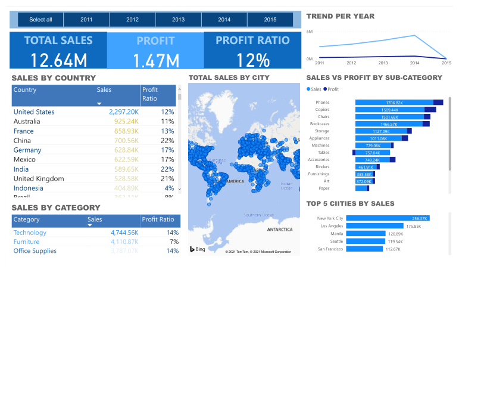

# Global-Superstore
Dataset extract from Kaggle to analyse information about orders made by customers around the world.

Source: https://www.kaggle.com/shekpaul/global-superstore

## Libraries
import numpy as np\
import pandas as pd\
import re\
import matplotlib.pyplot as plt

## PowerBI
I use the excel file to do a dashboard using PowerBI. The figure of dashboard is saved in the folder PowerBI.

